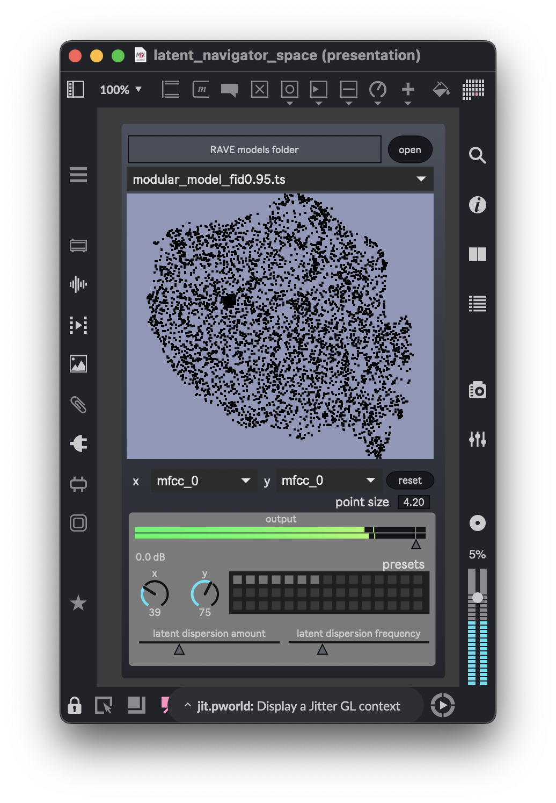

# RAVE Latent Space Explorer

A Python script for exploring the latent space of pre-trained RAVE models and generating datasets compatible with `fluid.dataset~` in Max/MSP, and a Max patch exploring the creative navigation of these datasets. 


*Main interface of the latent space explorer*

## Overview

This tool allows you to:
1. Sample points from a RAVE model's latent space
2. Generate audio from these latent vectors
3. Extract audio features using librosa
4. Create normalized datasets in JSON format for use with `fluid.dataset~`
5. Generate 2D UMAP projections of the feature space

## Requirements

- Python 3.x
- PyTorch
- librosa
- numpy
- scikit-learn
- umap-learn
- tqdm

## Installation

1. Clone this repository
2. Install the required dependencies:
```bash
pip install torch librosa numpy scikit-learn umap-learn tqdm
```

## Usage

The script takes a pre-trained RAVE model (`.ts` file) and generates several JSON files that can be used with `fluid.dataset~` in Max/MSP.

Basic usage:
```bash
python rave_latent_explorer.py path/to/your/model.ts output_base_name
```

### Command Line Arguments

- `model_path`: Path to the pre-trained RAVE model (.ts file)
- `output_json`: Base name for output JSON files (without .json extension)
- `--num_samples` or `-n`: Number of random latent vectors to sample (default: 1000)
- `--min_val`: Minimum value for latent dimensions during sampling (default: -2.0)
- `--max_val`: Maximum value for latent dimensions during sampling (default: 2.0)
- `--sr`: Sample rate for audio generation and analysis (default: 48000)
- `--device`: Device to use (cuda, mps, or cpu - default: cpu)
- `--num_frames`: Number of identical latent frames to decode consecutively (default: 1)

### Output Files

The script generates several JSON files:

1. `output_base_name.json`: Main dataset containing normalized audio features
2. `output_base_name_latent_vectors.json`: Original latent vectors
3. `output_base_name_metadata.json`: Metadata about the dataset
4. `output_base_name_umap_2d.json`: 2D UMAP projections of the feature space
5. `output_base_name_umap_metadata.json`: Metadata about the UMAP projection

### Using with fluid.dataset~

The generated JSON files follow the `fluid.dataset~` format:
```json
{
    "cols": number_of_dimensions,
    "data": {
        "sample_id": [value1, value2, ...]
    }
}
```

To use in Max/MSP:
1. Load the JSON file into `fluid.dataset~`
2. Use the dataset for machine learning tasks or visualization

## Example

```bash
python rave_latent_explorer.py my_rave_model.ts my_dataset --num_samples 500 --device cuda
```

This will generate:
- `my_dataset.json`: Normalized audio features
- `my_dataset_latent_vectors.json`: Original latent vectors
- `my_dataset_metadata.json`: Dataset metadata
- `my_dataset_umap_2d.json`: 2D UMAP projections
- `my_dataset_umap_metadata.json`: UMAP metadata

## Audio Features

The script extracts the following audio features using librosa:
- MFCCs (13 coefficients)
- Spectral centroid
- Spectral bandwidth
- Spectral contrast
- Spectral flatness
- RMS energy
- Zero crossing rate
- Chroma features

All features are normalized to the range [0, 1] before being saved to the JSON files.

## Max/MSP Integration

This repository includes a Max patcher (`latent_space_explorer.maxpat`) that allows you to interactively explore the latent space of your RAVE models. The patcher requires the following Max/MSP packages:

1. [nn_tilde v1.6.0](https://github.com/domkirke/nn_tilde/releases/tag/v1.6.0) from IRCAM
2. [Fluid Corpus Manipulation toolkit](https://github.com/flucoma/flucoma-max/releases)

### File Organization

For the Max patcher to work correctly:

1. Place all generated JSON files in the `datasets` folder of this repository
2. When running `rave_latent_explorer.py`, use the same base name for the output files as your model file name (without the .ts extension)

For example, if your model is named `birds_dawnchorus.ts`, run:
```bash
python rave_latent_explorer.py birds_dawnchorus.ts birds_dawnchorus
```

This will generate files like:
- `datasets/birds_dawnchorus.json`
- `datasets/birds_dawnchorus_latent_vectors.json`
- `datasets/birds_dawnchorus_metadata.json`
- `datasets/birds_dawnchorus_umap_2d.json`
- `datasets/birds_dawnchorus_umap_metadata.json`

### Using the Max Patcher

1. Open `latent_space_explorer.maxpat` in Max/MSP
2. Load your RAVE model using the file browser
3. Use the interface to explore the latent space and generate audio in real-time

## License

This project is licensed under the MIT License - see the [LICENSE](LICENSE) file for details.

